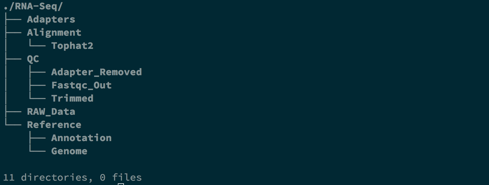

Introduction to Terminal
=========================

Overview of Linux
------------------

.. highlight:: rest

Linux is a free OS and very similiar to the UNIX OS in terms of
concepts, features.

`Linux Distributions <https://en.wikipedia.org/wiki/Comparison_of_Linux_distributions>`_

--------------

Linux System Structure
~~~~~~~~~~~~~~~~~~~~~~

Linux system has three main components:

:Kernel: It controls system hardware including memory,
   processors, disks, and I/ O (Input/ Output) devices. It schedules
   processes, enforces security, manages user access, and so on. The
   kernel receives instructions from the shell, engages appropriate
   hardware resources, and acts as instructed.

:Shell: **(This the important part for our class)** The shell is
   a program that accepts and interprets text-mode commands. The user
   provides instructions (commands) to the shell, which are interpreted
   and passed to the kernel for processing.

:Hierarchical directory structure: Linux uses the conventional
   hierarchical directory structure where directories may contain both
   files and sub-directories. Sub-directories may further hold more
   files and sub-directories. A subdirectory, also referred to as a
   child directory, is a directory located under a parent directory. >

   .. image:: images/LSS.png

   - /home/ username/dir1/ subdir1   -root (parent of *home*) 
   - home - sub-directory or child of / (*root*)

--------------

Starting a Shell
----------------

-  `Through
   SSH <https://pods.iplantcollaborative.org/wiki/display/atmman/Logging+In+to+an+Instance>`__
-  Using graphical interface

\*\* [] prompt, waiting for you to start entering commands.\*\*

--------------

Terminal Commands
-----------------

*pwd (Print Working Directory)*
~~~~~~~~~~~~~~~~~~~~~~~~~~~~~~~~~~~~~~~~~

When you first login, you are logged into your home directory
**(/home/username)**.

To find out what is your current working directory, type

.. code-block:: bash

   $ pwd
   /home/kiriya

*mkdir (makding a directory)*
~~~~~~~~~~~~~~~~~~~~~~~~~~~~~~~~~~~~~~~

To make a subdirectory called *Software* in your home directory, type

.. code-block:: bash

   $ mkdir Software

*ls (list)* 
~~~~~~~~~~~~~~~~~~~~~

To see what is inside the home directory, type

.. code-block:: bash
   
   $ ls

*cd (change directory)* 
~~~~~~~~~~~~~~~~~~~~~~~~~~~~~~~~~

To change the current directory to the "Software", type

.. code-block:: bash

   $ cd Software 

*:~$ cd ../* -by typying this you can go back to where you started.

--------------

Excercise
~~~~~~~~~~~~

Use the Terminal commands we already learned to do the following steps.

1. Creat following directory structure in your "Home Directory"

   *RNA-Seq/Reference/Genome*

   *RNA-Seq/Reference/Annotation*

   *RNA-Seq/RAW\_Data*

   *RNA-Seq/Adapters*

   *RNA-Seq/QC/Fastqc\_Out*

   *RNA-Seq/QC/Adapter\_Removed*

   *RNA-Seq/QC/Trimmed*

   *RNA-Seq/Alignment/Tophat2*

.. Note:: You might have to use "-p" option to create non-exsisting intermediate directories**

**Final output:**

File Handling Through the Terminal
-----------------------------------

Displaying Content of a Compressed gunzip File
~~~~~~~~~~~~~~~~~~~~~~~~~~~~~~~~~~~~~~~~~~~~~~

*zcat [filename.gz]*

.. code-block:: bash
   
   $ zcat sequence.fastq.gz | less

De-compressing gunzip File
~~~~~~~~~~~~~~~~~~~~~~~~~~

*gzip -d [filename.gz]* 

.. code-block:: bash
   
   $ gzip -d sequence.fastq.gz

Displaying Content of a File
~~~~~~~~~~~~~~~~~~~~~~~~~~~~

:cat: display whole content of a file on the screen
:less: display contents of a file onto the screen a page at a time
:head: display first ten lines of a file to the screen
:tail: display last ten lines of a file to the screen

*cat [filename]* 
^^^^^^^^^^^^^^^^^

.. code-block:: bash
   
   $ cat sequence.fastq | less

*less [filename]*
^^^^^^^^^^^^^^^^^^^

.. code-block:: bash
   
   $ less sequence.fastq

*head [filename]*
^^^^^^^^^^^^^^^^^^

.. code-block:: bash
   
   $ head sequence.fastq

*tail [filename]*
^^^^^^^^^^^^^^^^^

.. code-block:: bash
   
   $ tail sequence.fastq

Renaming a File
~~~~~~~~~~~~~~~

*mv [orginalfile.txt] [newnamefile.txt]*

.. code-block:: bash
   
   $ mv sequence.fastq new_sequence.fastq

Searching the Contents of a File
~~~~~~~~~~~~~~~~~~~~~~~~~~~~~~~~

*grep [options] [word\_to\_find] [filename]*

.. code-block:: bash
   
   $ grep "@" sequence.fastq
     @D00109:408:C77LEANXX:2:1101:1715:1962 1:N:0:18

Concatenating two or more files
~~~~~~~~~~~~~~~~~~~~~~~~~~~~~~~

*cat [fist\_file.txt] [second\_file.txt] [thrid\_file.txt] .... [N\_file.txt] > [output\_file.txt]*

.. code-block:: bash
   
   $ cat first.txt second.txt > third.txt

Finally, Compress that File!!
~~~~~~~~~~~~~~~~~~~~~~~~~~~~~

*gzip [filetocompress]*

.. code-block:: bash
   
   $ gzip sequence.fastq

Excercise
~~~~~~~~~~

1. Count the number of sequnces in a fastq.gz file
.. Note:: Use zcat and pip ("\|") the output to **grep -c** [word\_to\_grep]
